# Desafio
Desenvolver um sistema de transações de débito e crédito com um número reduzido de usuários (5 no total), e controlar a concorrência, o desafio é garantir que o saldo dos usuários permaneça consistente ao receber uma bateria de testes de carga com Gatling.

A solução precisa ter uma arquitetura mínima de 1 load balancer usando o algoritmo round-robin, 2 instâncias da API e 1 banco de dados relacional ou não relacional, tudo isso deve rodar dentro de uma VM mínima de 1.5 vCPU e 550MB de RAM, e todos os componentes da solução devem rodar em containers Docker via docker-compose.

Link do desafio original: https://github.com/zanfranceschi/rinha-de-backend-2024-q1/

## Critério do vencedor
A métrica utilizada para definir o vencedor é **chegar a 100 mil dólares:**

- Quem cumprir o SLA (98% das respostas com menos de 250ms) ganha 100 mil dólares
- Você recebe multa de 1.000 dólares para cada 1% abaixo desse SLA.
- Você recebe multa de 803,01 dólares para cada saldo inconsistente no banco de dados.

Se você chegou a 100 mil dólares, parabéns! Significa que você cumpriu SLA e não produziu inconsistência.

# Desenho da solução:
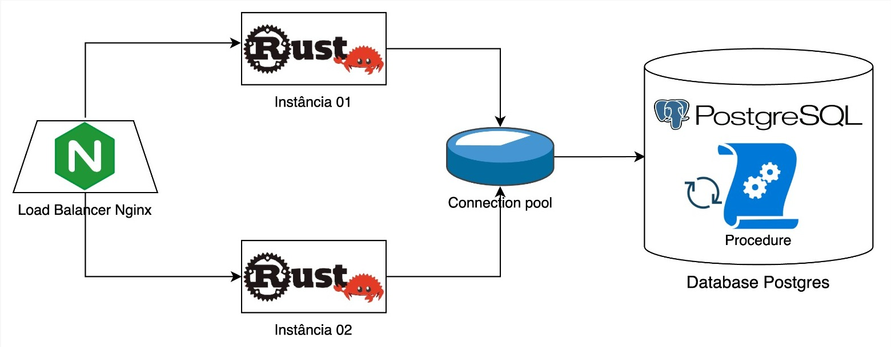

## Arquitetura Lógica

Tecnologias utilizadas na API Rust:

- Warp Framework Web
- Tokio Runtime Async
- SQLx

    
    
    

A API consiste nestes 6 arquivos:

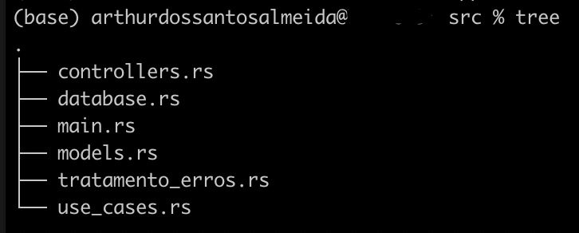

main é o ponto de entrada da aplicação, e os outros são 5 módulos:

    mod models;
    mod tratamento_erros;
    mod controllers;
    mod use_cases;
    mod database;

Abaixo está a forma de como esses módulos se relacionam na aplicação:

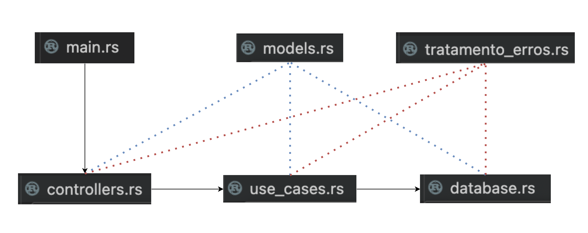

main chama controllers, que chama use-cases, que chama database, os módulos de models e tratamento-erros são utilizados tanto pelo módulo de controllers, como use_cases e database.

Sei que o ideal seria ter DTOs para uso dos controllers, dominios para uso dos use-cases, e entidades para uso do database, mas eu estava criando muitas structs com campos exatamente iguais, e estava adicionando complexidade desnecessária no projeto, então resolvi unificar, simplificar e criar models que seriam utilizados na aplicação toda.

## Modelagem do Database
Modelei as classes da forma mais simples possível, criei uma tabela clientes para representar [os cinco clientes mínimos que precisavam ser cadastrados](https://github.com/zanfranceschi/rinha-de-backend-2024-q1?tab=readme-ov-file#cadastro-inicial-de-clientes), e criei uma tabela transacoes pra guardar todas as transacoes que são realizadas.

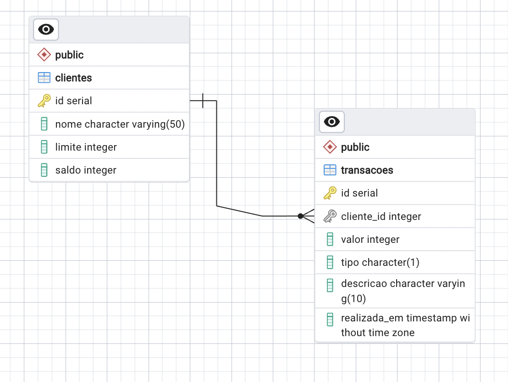

## Estratégia para controle de concorrência

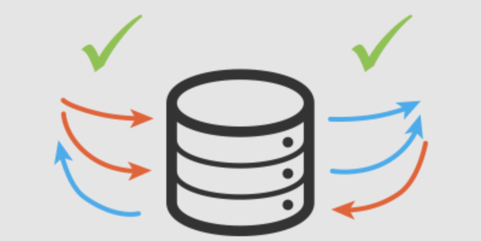

A minha idéia inicial era utilizar mutex e lockar a função inteira de transação, ou seja, colocaria o controle de concorrência na aplicação, então não teríamos race conditions á nível de código, mas teríamos race conditions a nível de sistemas distribuídos, ou seja, com 2 instâncias da aplicação rodando teríamos problemas de concorrência, então mutex não resolveria o problema... Mutex só resolveria o problema se a solução rodasse em apenas 1 instância.

Assisti alguns vídeos dos participantes da rinha mostrando suas implementações e a maioria utilizou Procedures, resolvi seguir a mesma estratégia, movi a regra de negócio de transação para uma Procedure no banco de dados, assim o controle de concorrência fica do lado do banco, ele bloqueia o registro selecionado para atualização por outras transações até que a transação atual seja concluída, então apenas uma transação por vez vai modificar os dados selecionados, e isso evita race conditions a nível de sistemas distribuídos, tanto com 1 quanto com N instâncias.

## Outras estratégias visando performance

### Query para Consultar Extrato

Não utilizei procedure, optei por fazer uma query na aplicação mesmo, com `LEFT JOIN` e Subquery pra pegar todos os registros que eu precisava, no início ela estava bem pesada:

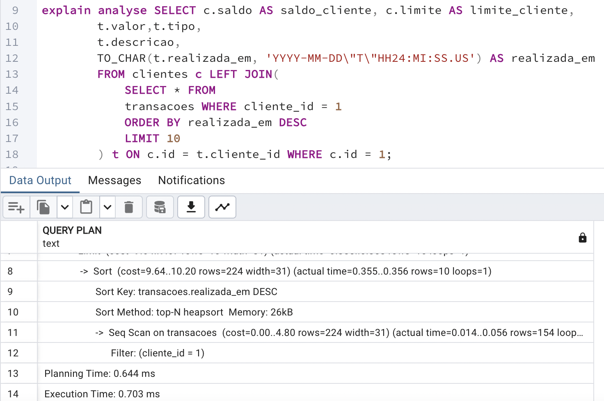

Então eu criei index para todos os campos utilizados nas cláusuras `WHERE` e `ORDER BY`:

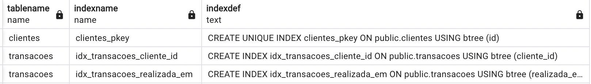

E a performance da query melhorou:

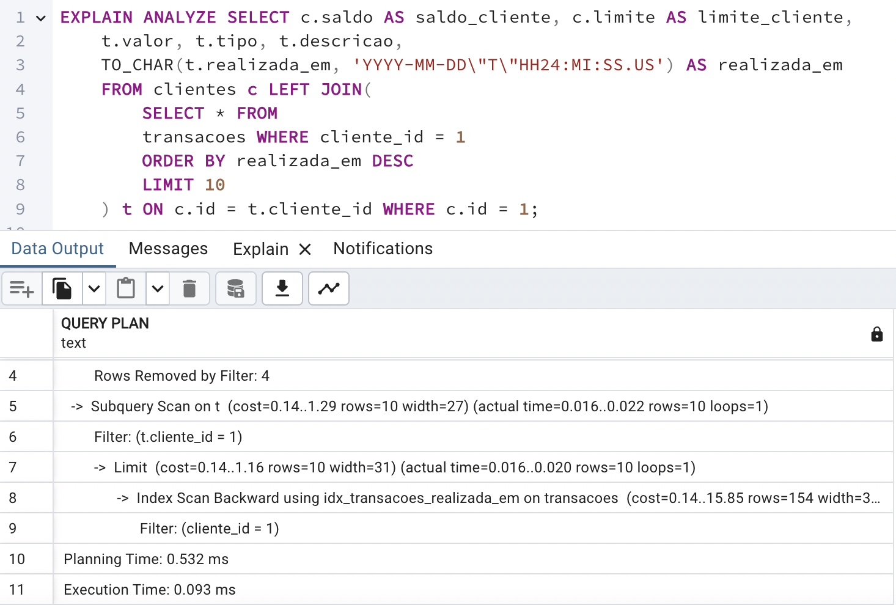

### Configuração de worker e pool de connections

Assim como na [rinha de backend passada](https://github.com/DeveloperArthur/rinha-de-backend-2023/tree/main?tab=readme-ov-file#configura%C3%A7%C3%A3o-de-worker-e-pool-de-connections), mantive no Nginx um `worker_connections` de 256, deixei 30 para o `max_connections` do Postgres e deixei o `connection pool` de 15 em cada aplicação.

## Executando teste:

Eu utilizei o K6 para fazer os testes de consistência durante o desenvolvimento:

    k6 run --vus 2000 --iterations 2000 ./app/race_condition_test.js

Para realizar a execução do teste do gatling mesmo, basta rodar o seguinte comando:

    sh executar-testes.sh

## Resultado final: 
- participante: DeveloperArthur
- multa SLA (> 249ms): USD 84950.0
- multa por inconsistência saldo: USD 0.0
- multa total: USD 84950.0
- valor a receber: **USD 15050.0**

No resultado final, meu valor a receber é 15050.0

Levei zero mutas por inconsistência no saldo dos clientes, esse é um resultado extremamente positivo, mas o que me ferrou foi o SLA... levei 84950.0 de multa... foram muitas requests que responderam com tempo maior que 249ms

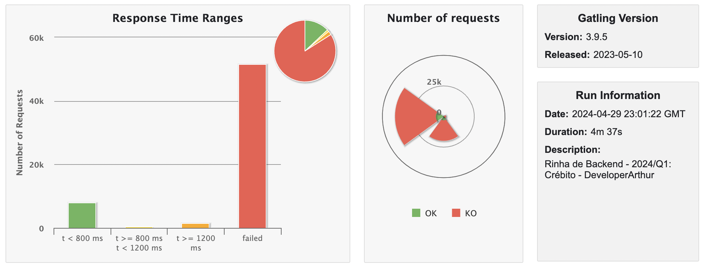
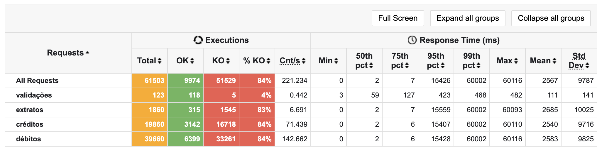
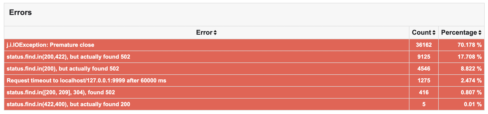
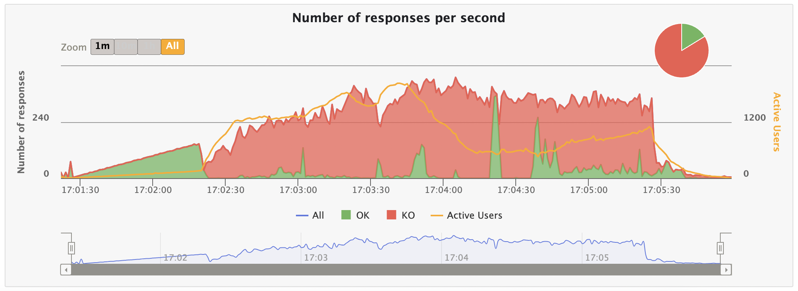